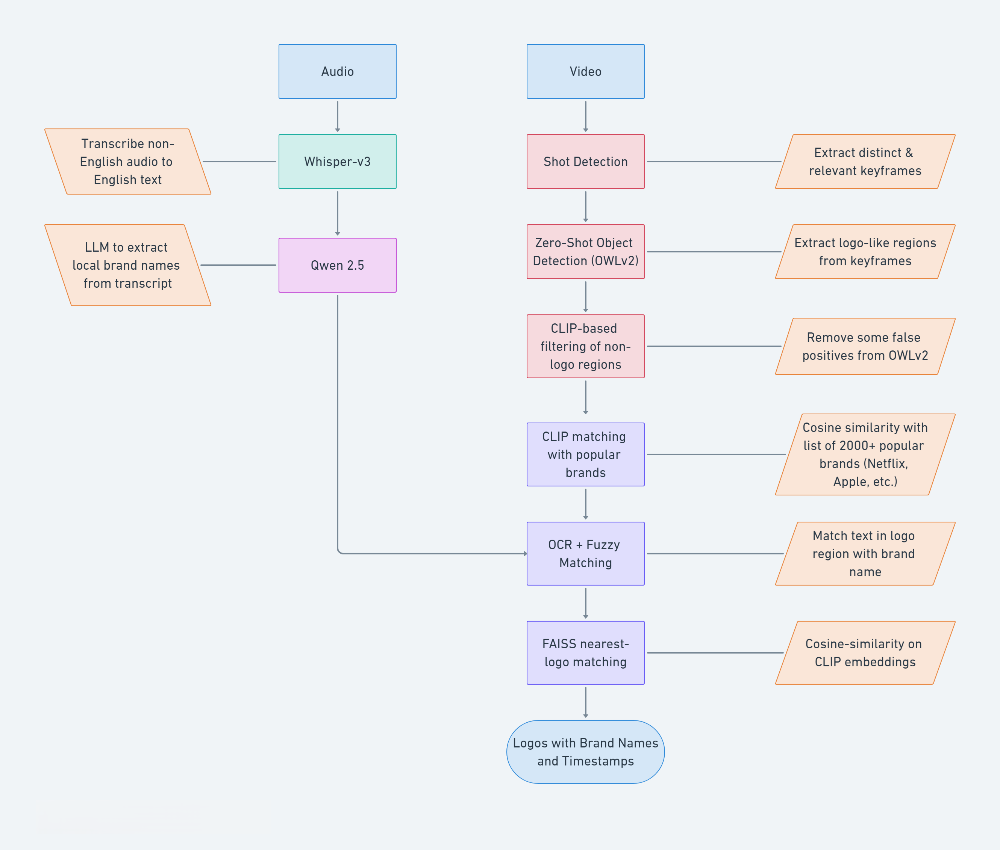

# 🎯 Semi-Automated Logo Detection in Brand Advertisement Videos

An application for semi-automated logo detection in brand advertisement videos using multimodal machine learning.

## Overview


This is an application that allows detection of logos in non-English brand advertisement videos using multimodal ML techniques. The overall pipeline is:
- Run the `Whisper` model on audio of the advertisement to transcribe it from the source language (Italian for e.g.) to English.
- Apply an LLM like `Qwen 2.5` to obtain all brand names mentioned in the audio transcript.
- Run _shot detection_ on the video to obtain the most distinct, relevant keyframes.
- On each keyframe, run a _zero-shot object detection_ model such as `OWLv2` with prompt to extract as many _logo-like_ regions as possible i.e. crops that may contain an actual logo.
- Candidate regions are filtered using a combination of **heuristic filters** (area, aspect ratio, texture, edge density, color variance) and **CLIP-based filtering** to remove false positives.
- All of the crops/regions then run through the following brand assignment techniques:
  - Use `CLIP` model to assign each region a brand from a list of top ~2000 brands (Netflix, Apple, etc.) obtained publicly from Kaggle.
  - Use `Optical Character Recognition (OCR)` along with `fuzzy string matching` to assign leftover regions a brand from the brand names extracted from the audio.
  - Use `FAISS` vector store to assign leftover regions a brand from the nearest-matching logo in the vector store. The vector store is pre-populated with the [LogoDet-3K](https://github.com/Wangjing1551/LogoDet-3K-Dataset) dataset for now.
- Optionally, a `Qwen` post-filtering step verifies each detected logo as Correct / Incorrect / Other.
- The `FAISS` vector store enables continual learning of new logos over time via human labelling, logo scraping, etc.
- A `Gradio` application allows the user to upload a video, run the pipeline, and view the matched regions/logos with corresponding brand names and timestamps.

## Advantages
- No need for manual training/fine-tuning of object detection models on custom logos.
- Local, indigenous brands detected using the audio transcript with OCR & fuzzy matching.
- CLIP model works quite well for detecting global, popular brands.
- Vector stores like FAISS enable continual learning and detection of new logos over time.
- Overall pipeline is agnostic to the domain (Ads, sports, etc.) and the source language.
- Multiple embedding model options for the FAISS store: **CLIP**, **DINOv2**, **SigLIP2**, or a hybrid — each with separate benchmarks to guide model selection.

### Streamlit — FAISS Logo Manager (`app/streamlit_faiss_app.py`)
A companion UI for managing and evaluating the logo vector store.

- **Logo Search**: Query the FAISS index with an image to find the nearest matching logo, with optional Test-Time Augmentation (TTA) for more robust retrieval.
- **Logo Ingestion**: Add new logo images to the index (with optional augmentation) to expand coverage over time.
- **Metrics**: Track retrieval quality and accept/reject results to maintain a feedback log.
- **Embedding model selection**: Switch between CLIP and SigLIP2 indexes from the sidebar.

## Usage

### Installation

Clone the repository and set up a virtual environment (optional but recommended):

```bash
git clone <repo-url>
cd Logo-Detection
python -m venv .venv && source .venv/bin/activate  # or .venv\Scripts\activate on Windows
```

Install dependencies for your platform:

```bash
# macOS
pip install -r requirements-macos.txt

# Windows
pip install -r requirements-win.txt
```

### Running the Streamlit app

```bash
cd app
streamlit run streamlit_faiss_app.py
```

## Benchmarking

The `benchmarks/` directory contains a full evaluation framework for comparing embedding models on logo retrieval:

- **Leave-One-Out (LOO) evaluation**: `benchmarks/run_loo_benchmark.py`
- **Crop-level evaluation**: `benchmarks/run_crop_benchmark.py`
- Supported models: CLIP, DINOv2, SigLIP2, and a DINOv2+CLIP hybrid.
- Results (CSV + plots) are saved to `benchmarks/results/`.

## Notebooks

Code for object detection models and VLMS is found in `Notebooks/`:

| Notebook | Description |
|---|---|
| `Phase1_Obj_det_Models_Testing.ipynb` | Comparison of object detection models for logo region proposal |
| `Phase1-Qwen3-Testing.ipynb` | Evaluation of Qwen models for brand name extraction |

> Note: Notebooks are designed to run on Google Colab due to GPU requirements.
